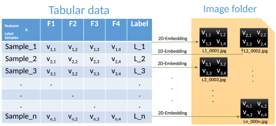
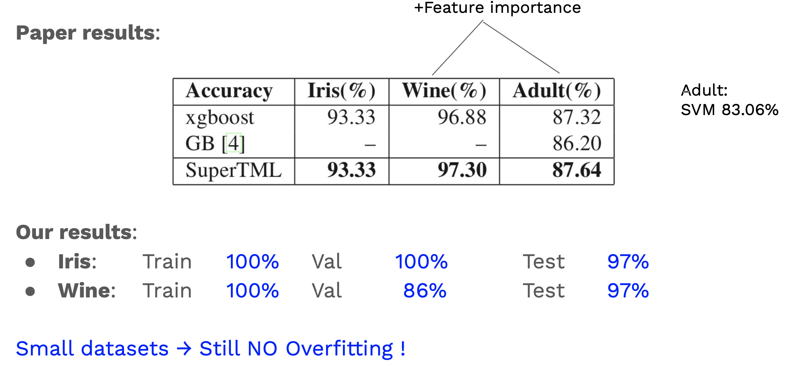

# SuperTML

Original Author: Ioannis Gatopoulos, 2020
Adjustments made by: Pepijn Sibbes, 2021

<p align="center">
  
</p>


## Description
PyTorch implementation of research paper:

_SuperTML: Two-Dimensional Word Embedding for the Precognition on Structured Tabular Data_


_Abstrack_: Projects tabular data to images creating 2-dimentional embenddings. Then, with the use of a pretrained model, it is capable of performing regression and classification tasks.


## Results
<p align="center">
  
</p>


## Required Python packages
Install all the dependencies:
```bash
pip3 install -r requirements.txt
```

## Run
```
cd super_tml
python main.py --dataset iris --model densenet121
```

## References
    - Baohua Sun.
    SuperTML: Two-Dimensional Word Embedding for the Precognition on Structured Tabular Data.
    CVPR Workshop Paper, 2019.
